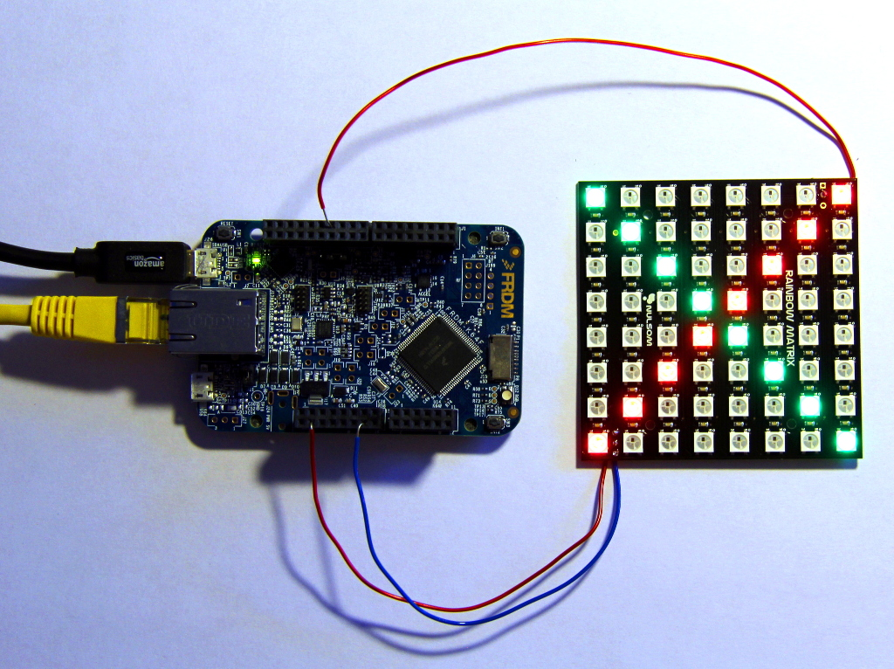

# WS2812 RGB array example for FRDM-K64F

This repository contains example software for controlling a WS2812 RGB LED array via network.

Supported platforms:
- [Freescale FRDM-K64F](http://developer.mbed.org/platforms/FRDM-K64F/) ([GCC ARM Embedded toolchain](https://launchpad.net/gcc-arm-embedded)).

## How To

The following section explains how to build, flash and run the example on OS X, Linux and Windows.

### Putting things together
In our example we use a [NeoPixel NeoMatrix](http://www.adafruit.com/products/1487) (alternatively a  [Nulsom Rainbox Matrix](http://www.amazon.com/NeoPixel-Rainbow-Matrix-Arduino-Built/dp/B00OM0UTS2)) and a [Freescale FRDM-K64F](http://developer.mbed.org/platforms/FRDM-K64F/) development board. The example code supports all [WS2182](https://www.adafruit.com/datasheets/WS2812.pdf)/[WS2182B](https://www.adafruit.com/datasheets/WS2812B.pdf) based RGB modules (zero-, one- and two-dimensional).

Wiring things up:
- connect RGB matrix data-input to the PTD2 pin on FRDM-K65F
- connect RGB matrix power to the FRDM-K65F 3v3 pin
- connect RGB matrix ground to a FRDM-K65F GND pin

you can find the [full pinmap here](https://developer.mbed.org/platforms/FRDM-K64F/#overview).



### Development Pre-Requisites

Please install the following:

* [yotta](https://github.com/ARMmbed/yotta). Please note that yotta has its own set of dependencies, listed in the [installation instructions](http://armmbed.github.io/yotta/#installing-on-windows).

#### Build

First, download the sources and navigate to the directory containing your source files:

```bash
git clone https://github.com/ARMmbed/example-mbedos-ws2812-rgb.git
cd example-mbedos-ws2812-rgb
```

yotta must know which platform (target) it is building to. So we declare the target, then build.

```bash
yotta target frdm-k64f-gcc
yotta build -r
```

for subsequent builds you only need to run 

```bash
yotta build -r
```
The resulting binary file will be located in
`./build/frdm-k64f-gcc/source/example-mbedos-ws2812-rgb.bin`

#### Flash

Connect your board to your computer USB port and simply drag & drop the binary file from the previous step into the `MBED` device listed in the file browser.

#### Run

Hit the reset button after flashing to start program execution. The application will be running right after you reset the processor. The red LED starts blinking with 100ms period.
